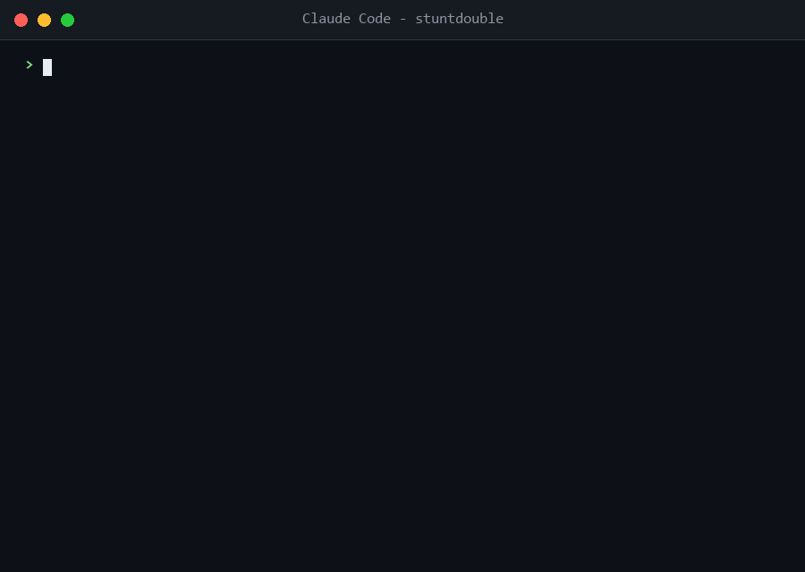

# 🎬 stuntdouble

> Your frontier model is the star. **Stop making it do the stunts.**

Hollywood doesn't film the star jumping off buildings — doubles shoot the
action scenes, the star shows up for the close-up. Same movie, fraction of the
cost, and the audience can't tell.

**stuntdouble** does this with AI models. It's an open source agent skill for
Claude Code, Codex, Gemini CLI and other agents: every task gets scored and
routed to the cheapest capable model (the doubles), and the strongest model
only enters at the end — to verify and polish (the close-up). It always uses
the host's own lineup — Claude models inside Claude Code, OpenAI models inside
Codex, Gemini models inside Gemini CLI. No proxy, no API keys, no
infrastructure. One markdown file.

## Demo



<details>
<summary>Text version of the demo</summary>

```
> /stuntdouble on

🎬 stuntdouble ON — the star only shoots the close-ups
Host: Claude Code · Doubles: haiku, sonnet · Star: fable

> build me a super modern landing page for the new Fable 5 model

Plan:
  HTML structure + copy   → haiku   (double)
  CSS design system       → sonnet  (double)
  JS canvas + interactions→ sonnet  (double)
  final close-up          → fable   (star)

🎬 That's a wrap — orchestrated across 3 models
HTML + copy        → haiku   (20.5k tokens)
CSS (1,073 lines)  → sonnet  (24.8k tokens)
JS interactions    → sonnet  (19.1k tokens)
verification       → fable   (fixed: 13 issues)
Est. savings vs. shooting everything with the star: ~40%
```

</details>

## Receipts 🧾

This isn't a synthetic benchmark — the repo includes a real build produced by the skill.

| Part | Model | Tokens |
|---|---|---|
| HTML structure + copy | haiku | 20.5k |
| CSS design system (1,073 lines) | sonnet | 24.8k |
| JS (canvas particles, scroll reveal, tilt) | sonnet | 19.1k |
| Final verification | frontier star | 86k |

The verifier caught **13 integration bugs** the doubles left behind. Three vivid examples: a doubled `requestAnimationFrame` loop burning 2x CPU (the init path and an observer callback each started the chain); mouse parallax that could never fire because the canvas had `pointer-events: none`; a mobile breakpoint that hid the entire nav links container — CTA button included.

~40% estimated savings vs. running everything on the frontier model, based on input-price ratios — savings vary by task; measure yours with `/cost`.

The result is in [`examples/fable5-landing`](examples/fable5-landing) — open `index.html` and judge the doubles' work yourself.

## Two modes

### 🎬 Orchestrator — set it and forget it

```
You:  /stuntdouble on
```

From then on, **every task you send** is scored, decomposed, and dispatched to
subagents running the right model per part — with a final verification pass by
the strongest model before delivery:

```
You:  build me a landing page with hero, pricing, FAQ and a contact form

Plan:
  hero + FAQ (static content) → haiku   (double)
  layout + pricing cards      → sonnet  (double)
  form with validation        → sonnet  (double)
  final close-up              → fable   (star)

🎬 That's a wrap — orchestrated across 3 models
Est. savings vs. shooting everything with the star: ~40%
```

Small tasks run directly — no subagent overhead on a one-liner. Turn off
anytime: `/stuntdouble off`

### 🎯 Advisor — one-shot recommendation

```
You:  /stuntdouble I need to rename a variable across 3 files
Skill: Recommended: haiku
       Why: mechanical edit, no deep reasoning needed
       Switch: /model haiku
       Saves: Haiku is ~15x cheaper than Opus
```

## How scoring works

Each task is scored on 4 weighted dimensions:

| Dimension | Weight |
|---|---|
| Cognitive complexity | 40% |
| Context size | 20% |
| Quality required | 25% |
| Speed/cost pressure | 15% |

…then mapped to a tier:

- **Low (≤0.33)** → Haiku / GPT-5.4-mini / Gemini Flash
- **Mid (0.34–0.66)** → Sonnet / GPT-5.5 / Gemini Pro
- **High (≥0.67)** → Opus–Fable / GPT-5.5 high effort / Gemini Ultra

Modifiers when relevant: extended thinking, reasoning effort, fast mode,
1M-context variants.

## Install

### One-liner (Claude Code)

macOS / Linux / WSL:

```bash
curl -fsSL https://raw.githubusercontent.com/Davienzomq/stuntdouble/main/install.sh | bash
```

Windows (PowerShell):

```powershell
irm https://raw.githubusercontent.com/Davienzomq/stuntdouble/main/install.ps1 | iex
```

### Via the skills CLI (Claude Code, Cursor, Codex + 40 more agents)

```bash
npx skills add Davienzomq/stuntdouble -g
```

### Manual

```bash
git clone https://github.com/Davienzomq/stuntdouble.git
# personal (all projects)
cp -r stuntdouble/skills/stuntdouble ~/.claude/skills/
# or per-project
cp -r stuntdouble/skills/stuntdouble .claude/skills/
```

Restart your Claude Code session, then run `/stuntdouble on`.

## Use

| Command | What it does |
|---|---|
| `/stuntdouble on` | Orchestrator mode ON for the whole session |
| `/stuntdouble off` | Orchestrator mode OFF |
| `/stuntdouble <task>` | One-shot: recommends the best model for that task |
| *"which model should I use for this?"* | Triggers advisor mode naturally |

> Tip: in orchestrator mode, run your session on **sonnet** — the director's
> chair doesn't need a frontier model; the star enters only for the close-up.

## Notes & limits

- The skill never runs `/model` for you — that's a user-level CLI command. In
  advisor mode it hands you the command ready to copy.
- Worker dispatch is host-aware: native subagents with a per-agent `model`
  parameter in Claude Code; child `codex exec -m <model>` runs in Codex; child
  `gemini -m <model>` runs in Gemini CLI. Hosts with neither fall back to
  "phase mode" (the skill plans the parts and recommends a model switch per
  phase).
- The skill only ever names models from the host's own provider — no Claude
  model names inside Codex, no OpenAI names inside Claude Code.
- Orchestration is skipped for small/atomic tasks: worker overhead would cost
  more than it saves.
- Savings are estimates based on price ratios; measure for real with `/cost`.

## Other providers

The skill detects when you're talking about OpenAI (GPT/Codex) or Google
(Gemini) and recommends from those catalogs. See
[`skills/stuntdouble/models.md`](skills/stuntdouble/models.md) for the full catalog.

## Contributing

Models change fast. To add or update a provider:

1. Edit [`skills/stuntdouble/models.md`](skills/stuntdouble/models.md) — models, tiers, modifiers.
2. Map the tiers in `SKILL.md`.
3. Open a PR.

## License

MIT
